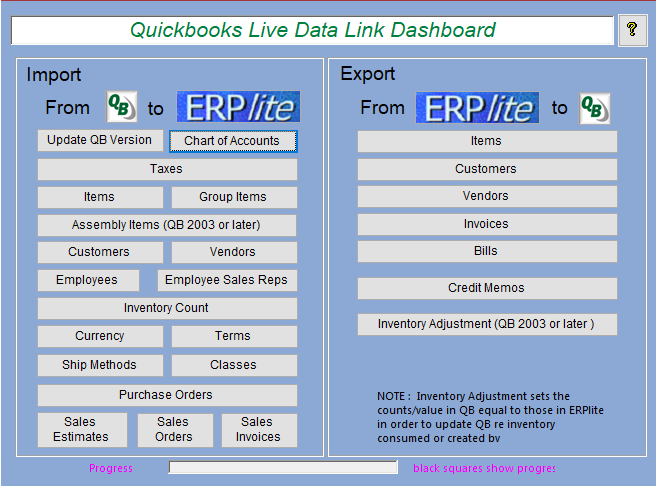
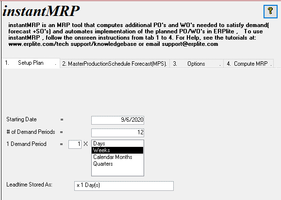

**June 26, 2018**

**INSTALLATION :: multiuser ERPLITE 10 IN Windows Server RDS**

1.  **OVERVIEW**

In this guide, we document the major steps (with screen shots) for
installing multiuser ERPlite 10 in Windows Server 2003/8/12/16+ Terminal
Services (now called Remote Desktop Services) .

In general, more concurrent users of ERPlite, and larger ERPlite
datasets can be hosted in Terminal Services than in client/server
installations, with fewer crashes and response times will be
dramatically better.

This is primarily due to the ERPlite front and backend running in the
same C: Drive and the same RAM memory.

The installation in AWS, Microsoft Azure, Citrix , VMware is very
similar.

.

**Note: sample data will be used for IP addresses, Usernames , Product
Keys etc. Yours will be different.\
2.0 INSTALL ERPLITE Free Trial**

Download and install the free trial version of ERPlite from
[www.erplite.com](http://www.erplite.com) using a Windows Server user
with Administrator permissions. Note that the last step of this
installation procedure converts the 14 day free trial license to
perpetual.

ERPlite will install Microsoft Access runtime. If you need the features
of a retail copy of Access to do advanced administrative tasks ( like
Direct Table viewing/editing , design changes to Reports etc), then
install a full copy of Microsoft Access or Microsoft Office that
includes Access (note this can be done later, when needed).

ERPlite Client will open to the following page.....

**3.0 DO NOT** (at this time)

Do not click OK on any windows or OK at this time. Click **x** to close.

OK, OK.....if you have clicked the OK's, then....

Do not use any ERPlite features (ie don't click on anything in the
Switchboard submenu's) until step 5.

That is close the ERPlite client front end.

**3.1 UPDATE Location of the ERPlite Frontend and Desktop Icon**

ERPlite installs in the C:\\ERPlite folder. The frontend installs as

C:\\ERPlite\\DbM_fe.mdb

.... because the installer assumes a single user installed in
WinXP,7,8,1,10.

For Windows Server, each user requires their own frontend. Thus the
installation process is....

1.  Delete the single user ERPlite desktop icon (right click on the
    Desktop Icon and select delete

2.  For each user, create a subfolder ...eg C:\\ERPlite\\UserX

3.  Copy/Paste C:\\ERPlite\\DbM_fe.mdb into the user subfolder....
    resulting in C:\\ERPlite\\UserX\\DbM_fe.mdb

4.  Create a desktop shortcut by right clicking on
    C:\\ERPlite\\UserX\\DbM_fe.mdb...and selecting Create Shortcut.

5.  Rename the Shortcut by right clicking on the file, and changing the
    file name from "DbM_fe.mdb -- Shortcut" to something like "ERPlite
    UserX".

6.  Paste the shortcut on the Desktop.\*\* ( often to
    C:\\Users\\Public\\PublicDesktop )

7.  Repeat steps 2 thru 6 for each user.

**\*\* Note that the above method is straightforward, but will have
Users ERPliteX Desktop Icon's visible to all users. Depending on your
version of Windows Server, your IT staff can configure so that each user
has their own desktop...which only shows their ERPlite desktop Icon OR
they can have their ERPlite frontend open directly.**

**\
**

**4.0 Add Users to the "Remote Desktop Users Group"**

## Creating a Local User on Windows 2003 server

1.  From the Windows **Start** menu select **Administrative Tools \|
    Computer Management**. If this menu item does not exist, you are
    either not an administrator for the computer or the server is a
    domain controller and you need to create a domain user instead.

2.  From the **Computer Management** dialog, navigate to **System Tools
    \| Local Users and Groups \| Users** on the left panel; right click
    on **Users** and select **New user** from the popup menu.

3.  In the **New User** dialog, enter **User name** User1 (for example),
    **Full name** and **Description**, respectively (latter 2 fields are
    optional).

4.  Uncheck box **User must change password at next login** and then
    check box **Password Never Expires**.

5.  Click the **Create** button to create the user and then click Close
    button.

6.  Repeat 2 thru 5 for each additional user.

**\
5.0 Add users to the Remote Desktop Users Group**

## To add users to the Remote Desktop Users group

1.  Open Computer Management.

2.  In the console tree, click the **Local Users and Groups** node.

3.  In the details pane, double-click the **Groups** folder.

4.  Double-click **Remote Desktop Users**, and then click **Add\...**.

5.  On the **Select Users** dialog box, click **Locations\...** to
    specify the search location.

6.  Click **Object Types\...** to specify the types of objects you want
    to search for.

7.  Type the name you want to add in the **Enter the object names to
    select (examples):** box.

8.  Click **Check Names**.

9.  When the name is located, click **OK**.

10. Repeat these steps to add each user.

**\
6.0 Login via Client PC**

The Remote Desktop Connection is usually located in Start \> Programs
\>Accessories one of its subfolders.

Enter the IP address of Windows Server 2003

Open ERPlite by clicking on the Desktop Icon .

Note1: If the Desktop Icon doesn't work, then open ERPlite by double
clicking on C:\\ERPlite\\DbM_fe.mdb in Windows Explorer. Make a new
desktop icon .

Note2: Sometimes the permissions of the C:\\ERPlite folder are too
restrictive. Make sure

Each user has "Full Control" permissions for this folder.

After clicking OK on the configuration screens ( if not already
clicked), the normal ERPlite Switchboard appears.....

ERPlite will look and operate the same as if it was installed on your
local PC, but in fact it is running on the server. This means that very
little data is being sent over the network to the local PC, which
results in much faster response times.

**7.0 Request Permanent License**

Email support@ erplite to request the conversion of the 14 day free
trial license to permanent.

**Appendix : Trouble Shooting/Support**

7.1 if you get an error message "C:\\ERPlite\\DbM_fe.mdb...already in
use", you need to edit the Desktop Icon as in section 3.1

7.2 . If the users Desktop Icon goes missing, paste a copy into
C:\\Users\\Public\\PublicDesktop (this is usually a hidden folder, so
unhide it if necessary).

**SUPPORT**

Email <support@erplite.com> with

1.  attached screens shots to help define your issue.

2.  version of ERPlite (eg 10123).

3.  version of Windows Server
