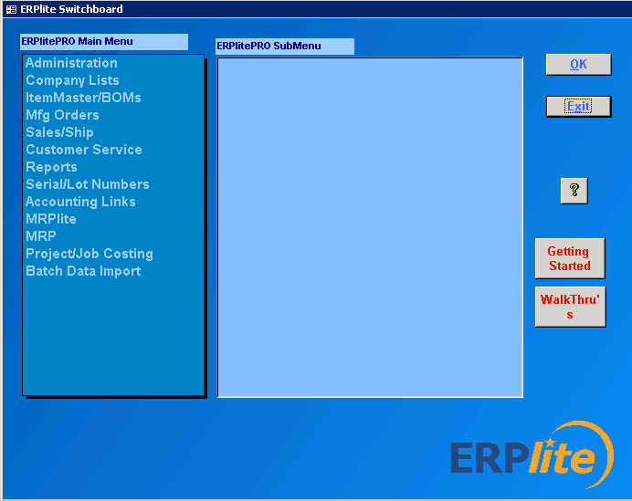
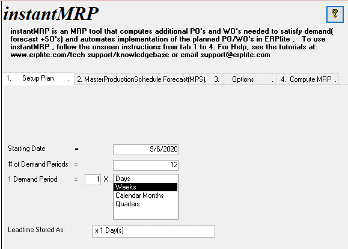
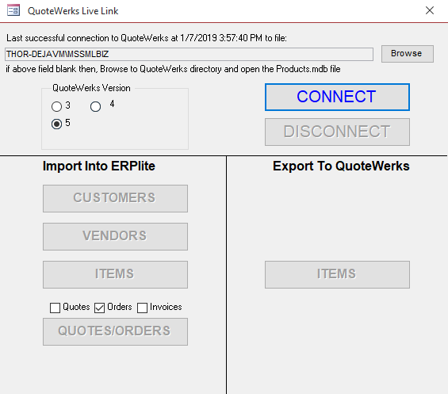
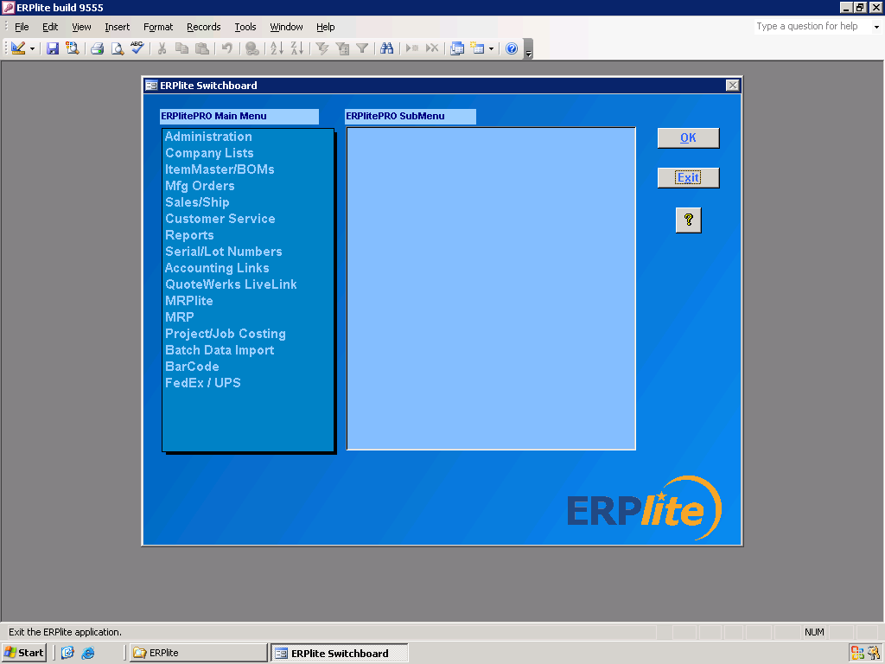
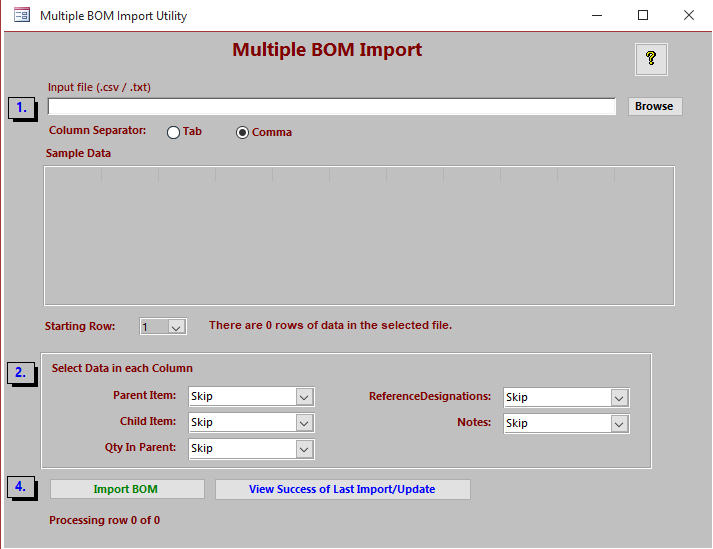

<h2>ERPLITE PRO FEATURES</h2>

Overview

Advanced manufacturing inventory management features for an affordable
cost, including self implementaton in days without the need for IT
skills.

 

-   Track inventory in multiple locations and bins

-   Track inventory by serial/lot number by location

-   barcode reading/writing

-   Quickbooks integration

> 

-   Multi-user in Windows PCs or in the Cloud

-   unlimited Bill of Materials levels

-   multiple units of measure

-   multi-currency

-   Shipping Automation

>  

-   Open Source..... so, you can customize

-   Manufacturing Requirements Planning

>  

-   routing lists

-   Add users as needed

-   Cycle Counting

-   RMA (Return Materials Managment

-   Repair Serice Order

-   Customize easily\...using MS Access

-   autocreate PO\'s from shortages list

-   barcode data entry

-   MS Access, SQL Server or MYSQL

-   Desktop installation or Terminal Services

-   install in cloud host (Azure, AWS, Cloud9, ACE etc)

-   Auto-populate Excel Template Reports

-   QuoteWerks Integration

>  

-   Parts&Vendors Integration

 

-   Import Multiple Bills of Material

 

<h2>Downloads</h2>

Try out ERPlite.....download the installer from the link below....and follow the on screen instructions....

Do the Getting Started Tutorial to learn how to use ERPlite.

Note....for additional downloads (tutorials, installation in Win Server etc)...click the button below the EPRlite title above.
