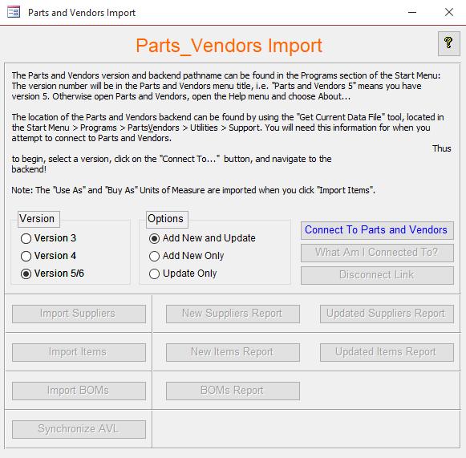

<h2>ERPLITE PRO FEATURES</h2>

Overview

Advanced manufacturing inventory management features for an affordable
cost, including self implementaton in days without the need for IT
skills.

 

-   Track inventory in multiple locations and bins

-   Track inventory by serial/lot number by location

-   barcode reading/writing

-   Quickbooks integration

> 

-   Multi-user in Windows PCs or in the Cloud

-   unlimited Bill of Materials levels

-   multiple units of measure

-   multi-currency

-   Shipping Automation

>  

-   Open Source..... so, you can customize

-   Manufacturing Requirements Planning

>  

-   routing lists

-   Add users as needed

-   Cycle Counting

-   RMA (Return Materials Managment

-   Repair Serice Order

-   Customize easily\...using MS Access

-   autocreate PO\'s from shortages list

-   barcode data entry

-   MS Access, SQL Server or MYSQL

-   Desktop installation or Terminal Services

-   install in cloud host (Azure, AWS, Cloud9, ACE etc)

-   Auto-populate Excel Template Reports

-   QuoteWerks Integration

>  

-   Parts&Vendors Integration

 

-   Import Multiple Bills of Material

 
